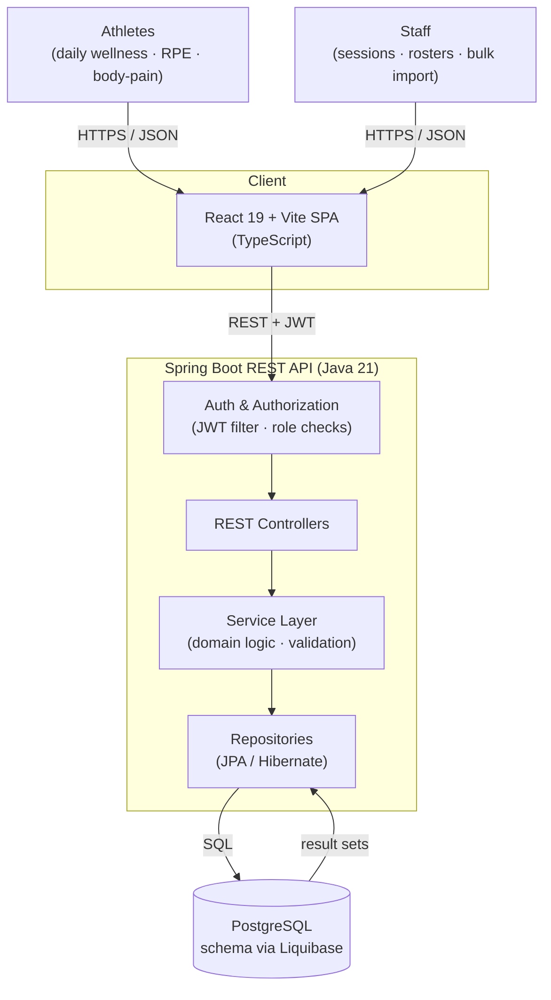

# 1 — High-Level Architecture

A classic layered web architecture. A single-page React frontend talks to a stateless
Spring Boot REST API; every request is authorized at the controller boundary before a
service-layer call orchestrates domain logic and persists through JPA/Hibernate to a
single PostgreSQL database. Data enters the system from two sources only: athletes
self-reporting daily metrics, and staff managing training sessions and rosters.

**Notes**
- The API is stateless: each request carries a JWT; authorization (organization/team role) is resolved per request.
- The service layer is the only place that mutates domain state; controllers stay thin and repositories stay query-only.
- Liquibase owns the schema; the application never auto-generates DDL.
