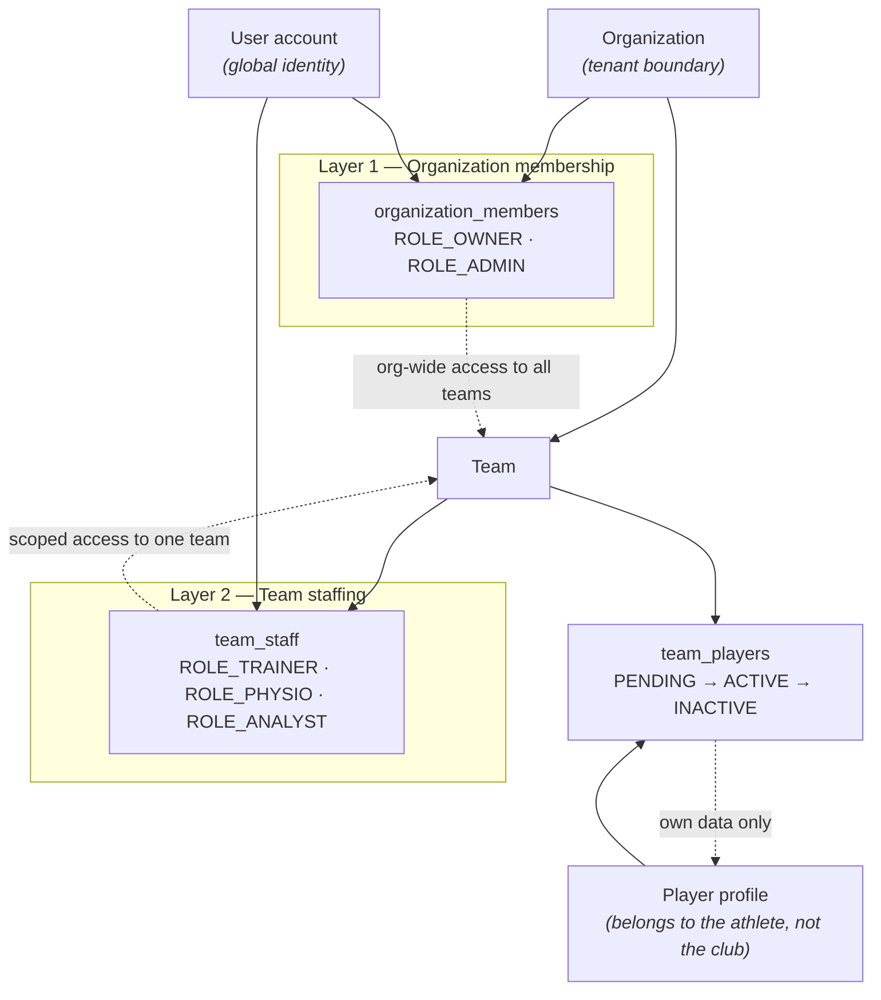

# 2 — Multi-Level Permission Model

Authorization is multi-tenant with the **organization** as the tenant boundary, resolved
across two independent membership layers. The **organization layer** grants org-wide roles
(owner/admin); the **team layer** grants per-team staff roles (trainer/physio/analyst).
A user's effective access is the union of both. Athletes are not staff: they reach a team
through roster enrollment and can only ever see their own data.

**Effective access**
- **Owner / Admin** — full access to every team in the organization.
- **Trainer** — full management of their team (sessions, imports, all data).
- **Physio** — read-only clinical view (injuries, body-map, wellness).
- **Analyst** — read-only performance view (RPE, sessions).
- **Athlete** — own data only; a single account can be enrolled in multiple teams.
