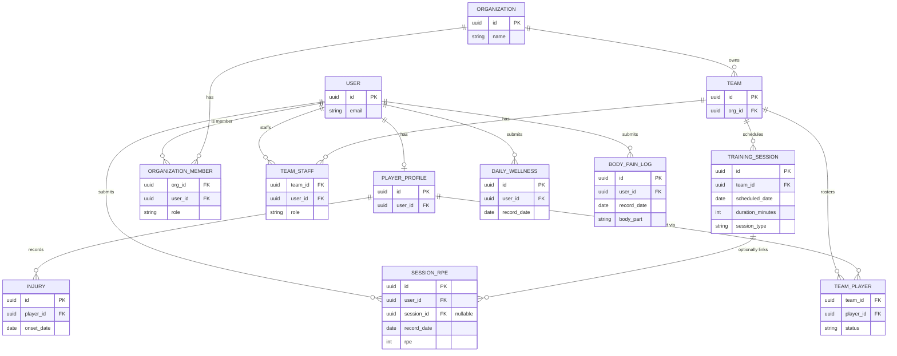

# 3 — Domain Model (ERD)

The core domain in simplified form — key entities and relationships only, not every column.
A **global user identity** owns a portable **player profile**; tenancy and staffing flow
through join tables (`organization_members`, `team_staff`, `team_players`). All daily
metrics (`daily_wellness`, `session_rpe`, `body_pain_log`) are keyed by athlete and
`record_date`, which is the axis that joins them. A training session is optional: RPE can
be submitted with no session and linked later.

**Key constraints**
- `daily_wellness` — one row per athlete per day.
- `body_pain_log` — one row per athlete per day per body part.
- `session_rpe` — up to two per athlete per day; `session_id` is nullable.
- Team training load (`duration_minutes × avg RPE`) is computable only when a session exists; individual metrics are always available.
