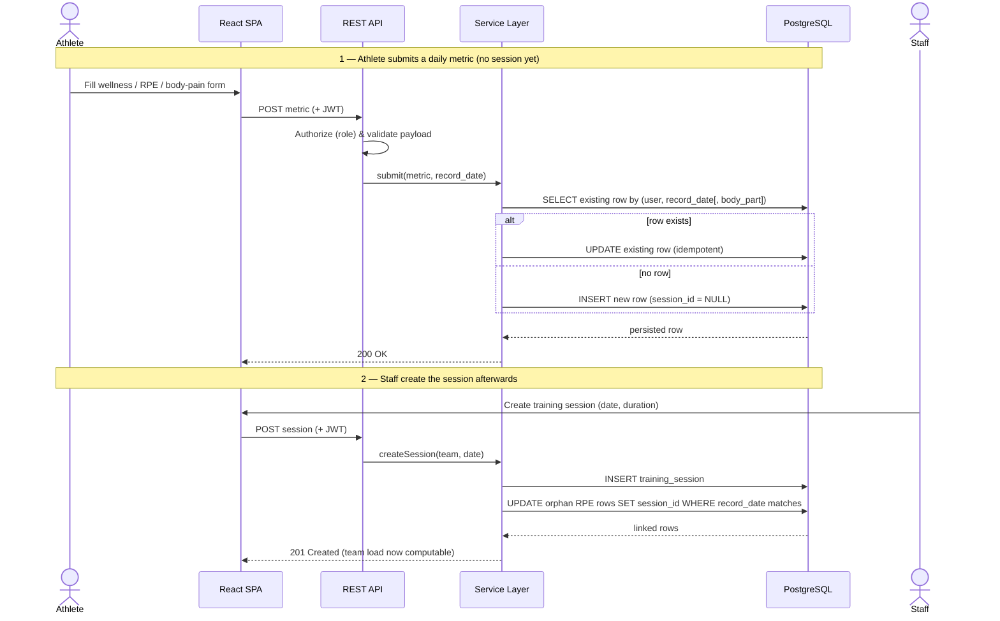

# 4 — Data Submission Flow

How a daily metric travels from athlete to database, and how late-created sessions reconcile
with already-submitted RPE. Submissions are **idempotent**: each metric is uniquely keyed by
athlete and `record_date` (and body part, for pain logs), so re-submitting updates the
existing row instead of duplicating it — an upsert. Because `session_id` is nullable, an
athlete can log RPE before any session exists; when staff create the session later, the
backend links orphan RPE rows by matching date.

**Notes**
- Idempotency comes from the database's uniqueness keys, not application-side dedup logic.
- Linking is by `record_date`, so the order of athlete vs. staff submission does not matter.
- Bulk staff imports follow the same service path, so they obey the same upsert and linking rules.
